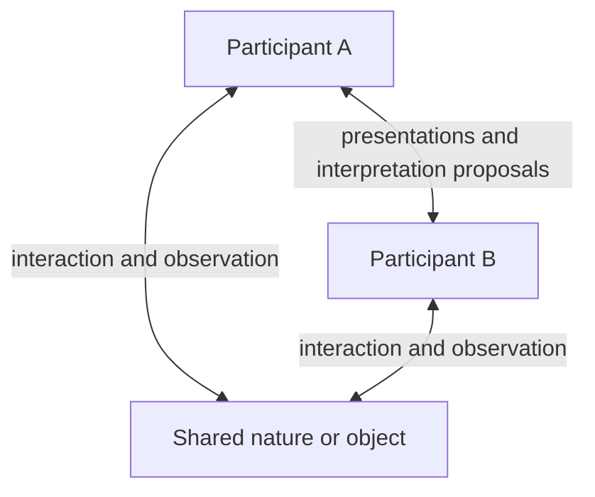

# Two compatible readings of the three sides

Version 0, 2026-09-16. Status: **the two readings are adopted for the current
framework discussion**; their operational correspondence is a research design
obligation. Mingli Yuan identifies the sides as participant A, participant B,
and their shared natural world or object of inquiry, and also retains the
library's Surface / Knowledge / Substrate reading.

Original formulation by ChatGPT (OpenAI), contributed under Unknown v0.3
through Mingli Yuan's authorized account proxy; account use is not his review,
endorsement or a correctness guarantee.

This clarification accompanies [transport/communication v2](transport-communication-v2.md)
and [free process v0](free-process-v0.md). Their pinned bytes and the existing
calibration remain unchanged. The earlier description left the intended sides
open and illustrated three supplied charts; the user's clarification does not
turn that illustration into a model of the actual participants and their world.

## The two readings

| Reading | What its three terms identify | What must be made explicit in a task |
| --- | --- | --- |
| Participant A / participant B / shared nature or object | Two participants interacting with one another and with what they seek to understand | The shared question and object, each participant's observations, methods, initial position and remaining uncertainty |
| Surface / Knowledge / Substrate | The retained library naming of presentation, content and realization duties | Which interfaces present the inquiry, which constructions and evidence express it, and which processes carry and check it |

These readings can apply together. They are not competing choices and their
listed order does not prescribe a positional identification.

The retained [party naming layer](../../adva-library/names/party-naming-layer-v0.json)
records `Human -> Surface`, `World -> Knowledge`, and `Machine -> Substrate`.
This reference is fixed by library revision
`73a6af4ac4ed8225366d3c16794e309cff15f51d` at machine base
`43c10a25b819436607a517ec7d5a05acc633e183`. Its labels and duties are documentary;
its native identification and recorded acceptance gaps keep their original scope.

For a human-machine inquiry, a possible assignment is A in the Human/Surface
role, B in the Machine/Substrate role, and the inquiry's World in the
World/Knowledge role. This is a proposed contextual use of those labels, not a
proof that the object is identical to its recorded knowledge. When A and B are
both people or both machines, the task needs its own role assignment; the
historical naming layer does not prohibit such communication. More generally,
describing each participant's own interfaces, knowledge and realization is a
possible refinement, not a correspondence already implemented by this note.

## The object constrains communication

The third side need not speak, sign a receipt or possess an account. It enters
the inquiry through interactions, observations, executable behavior and other
declared checks. Participants can be part of the same natural world; the
diagram marks task-relative relations, not three disjoint physical universes.

Keep the object distinct from A's description, B's description, the proposed
common interpretation and the record that binds them. An observation is also
mediated: retain its instrument or method, inputs, conditions, source, limits
and failures. A copied observation is not a fresh independent observation, and
calling a record the world's answer does not authenticate it.

Agreement between A and B is one result of communication. A claim about their
object also needs the applicable object-related evidence. Both participants
can agree on an interpretation that fails its declared test. Conversely, an
unresolved disagreement can help locate an ambiguity or missing observation.
Neither unanimity nor an object's silence supplies proof or consent.

## Anchoring, pressure and free

The initial anchor binds the common question and object scope, A's and B's
starting readings, their available methods, proposed comparison, protected
obligations and finite resources. It does not require equal beliefs or assume
that a common interpretation has already been found. A changed object state
or measurement context must be recorded; changing the question cannot silently
carry over the previous evidence's scope.

For this reading, the following is a proposed way to make pressure concrete:

- A versus B: terms, predictions or intended actions that do not yet correspond.
- A versus the object: the declared gap between A's expectation and observation.
- B versus the object: the corresponding gap for B, retaining its own method.

These gaps require task-specific definitions; they are not automatically three
numbers with common units. A common energy or scalar objective needs its own
mapping and calibration. In the Surface/Knowledge/Substrate reading, the task
must additionally explain how presentations, retained constructions and actual
realizations expose or preserve these gaps.

`transport` carries the available presentations under a shared representation
contract. `communicate` seeks and tests how the heterogeneous readings can
relate while remaining answerable to their object. `free` names the developing
process of anchored adjustment, scoped balance and justified continuation.
Its acceptance conditions must include any object-related checks required for
that continuation, alongside participant-specific requirements and residuals.
Local balance can retain disagreement and nonzero tension; it does not require
the participants or the world to exhaust all further possibilities of inquiry.

The proposed `33/100, 33/100, 33/100, 1/100` allocation also needs a contextual
account. If applied to A/B/object, the third share can provision interaction,
measurement and retention concerning the object, with a named operator; the
world itself does not receive a computational allowance. This is a proposed
allocation interpretation, not a measured optimum or an implementation. Keep
the separate joining reserve, exact units and failed-attempt costs described
in v2. The role clarification does not choose a universal allocation policy.

## Reuse boundary

The [successor structure card](../../exchange_routine/examples/free-context-v1.json)
retains both readings and the previous card's open obligations. It adds the
shared object's observation boundary; no required participant or object-side
evidence is fabricated. Its JSON version remains `adva.structure-card.v1`;
documentary IDs and relations are not native semantic identities.

The A2 calibration still checks C/S/T chart correspondences on one supplied
integer carrier. It demonstrates neither of these role assignments nor the
relation between them. Three roles, three charts, three independent executions
and three repositories remain distinct unless a concrete checked mapping is
supplied. The two readings being appropriate does not by itself establish
such a mapping.

This change authors framework documentation and a discussion card. It adds no
native communication, free adapter, catalog admission, observation or release
effect. The [conditional theory](triadic-free-theory-v0.md) gives precise
existence, balance and finite adjustment criteria, with counterexamples to
stronger claims. To instantiate it, name one shared object and question,
retain A's and B's different presentations, and state one object-related test
that could challenge their proposed common interpretation.
